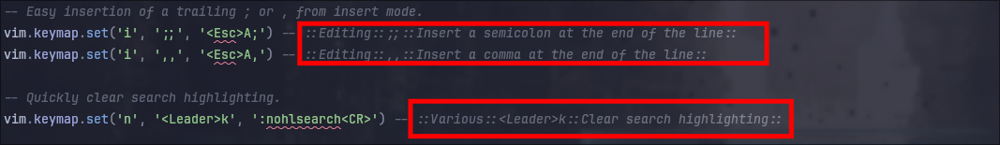
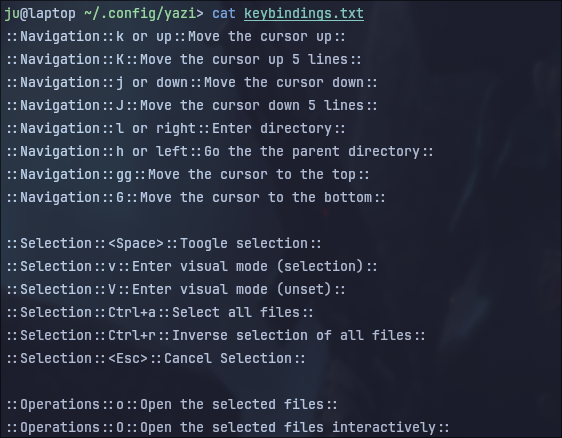

# Kebihelp - The Universal Linux Key Bindings Helper

Kebihelp is an universal key-bindings helper for Linux, written in Python and initially inspired by AwesomeWM and its "Mod4+s" feature.


Click on the picture to zoom.

In this demo:
- <F1> displays the helper
- <TAB> key is used to cycle through the tabs.
- <ESC> or <q> is used to close it

## Features

- Facilities to import shortcuts from text files or [QuickRef](https://quickref.me)
- Organize shortcuts with Tabs and Groups
- Customizable design (colors, opacity, fonts, etc.)
- Configuration in a single JSON file
- Window Rules supported, to show the shortcuts for the current focused app

## Installation

The package is published on PyPi. Installation with the virtual environment Venv:

```
mkdir ~/Tools/kebihelp && cd ~/Tools/kebihelp
python3 -m venv venv
source ./venv/bin/activate
pip install kebihelp
kebihelp show -a
```

## Usage

The code is a Python 3 script using PyQT5. You just need to clone this repository and run `pip3 install -r requirements.txt`.

Then you have to launch `kebihelp` with the relevant options. The tool has 5 main commands:

- `import` to import a file containing shortcuts
- `list` to show the keybindings configured (console mode)
- `show` to show the keybindings configured (GUI mode)

For each command, you can type `kebihelp <command> -h` to get help.

The configuration file is stored in `~/.config/kebihelp.json`, which is a JSON file. You can add/modify your shortcuts there.

When the helper is launched with the `kebihelp show`, you can navigate through the tabs with the `<TAB>` key. The helper is closed with the `<ESC>` or `q` key.

### Importing keybindings

Instead of entering manually each keybinding, you can import them from text files or from [Quickref](https://quickref.me)

The syntax to import is as follows: 

```
kebihelp import -t <destination_tab> -s <path>
```

- If the path is an URL starting with `https://quickref.me/`, the corresponding Quickref keybindings will be imported.
- If the path is a local directory, all files will be analyzed recursively to search for keybindings to add, according to the following syntax:


```
::Group name::Key binding::Description::
```

Example:

```
kebihelp import -t Nvim -s ~/.config/nvim/
```

These can be anywhere in your various files. Example for Nvim:



You can also create a text file anywhere with your keybindings. This is what I did to register key bindings for Yazi (a command-line file manager): 



Once imported, you can reorganize or modify the imported keybindings by editing the `$HOME/.config/kebihelp.json` file. 

#### Customizing the format of keybindings

In the configuration file `kebihelp.json`, you are free to change the format of Keybindings. The default configuration is as follows:

```
    "importer": {
      "match_line": ".*::(.+?)::(.+?)::(.+?)::.*",
      "position_group": 1,
      "position_keybinding": 2,
      "position_label": 3
    },
```


### Displaying keybindings (CLI)

The command `kebihelp list` will show all keybindings in your terminal.

You can also filter the list by using the option `-t <tab name>` to show only the keybindings for a particular tab.

Example:

```
# Show only Hyprland keybindings
kebihelp list -t Hyprland
```

### Displaying keybindings (GUI)

To show a window with all keybindings, just type `kebihelp show`. 

If you use a tiling window-manager, it's recommended to add a rule to set this window in floating mode.

Once displayed, you can navigate through the tabs by using the `<TAB>` key, and you can close the window using the `<Esc>` or `q` key.

The `show` command accepts also the option `-t <tab>` to display directory a particular tab instead of the default one. 

### Rules

In the `kebihelp.json` file, you can define rules to show a particular tab depending of the current focus. For instance, if you are in a Nvim session and you launch Kebihelp with a keybinding, it will show directly the "Nvim" keybindings.

Example:
```
 "Rules": {
    "_default": "Hyprland",
    "NVIM": "NeoVim"
  },
```

Here, the default tab will be the keybindings for Hyprland. However, if you are in NVIM (eg the class/title of your current window contains the text "NVIM"), it will show the tab `NeoVim`.

To determine the current focused Window name, Kebihelp uses a command that you'll have to define in the `Parameters`. The command you set up should return one single line with the information you want.

Example: 
```
{
  "Parameters": {
    "cmd_focused_window": "hyprctl -j activewindow | jq '.class + \" - \" + .title'",
  }
}
```

Here, the current focused window name is determined with `hyprctl` (Hyprland CLI tool), and then the class and title of the window will be shown.

To launch Kebihelp with the automatic detection, add the `-a` or `--auto` option: `kebihelp show -a`

### Hiding tabs, groups or keybindings

Instead of removing them entirely from your `kebihelp.json`, you can hide a tab, a group or a particular keybinding by setting up the `_hidden` key to `true`. Once set up, the tab, group or keybinding will not be shown anymore in the GUI.

### Customizing the GUI

You can configure the visual aspect of the GUI helper:

- Font name and size of any part
- Colors 

To do that, edit the `kebihelp.json` config file.


## Feedbacks

This tool is not perfect, but it may be useful to build your own "keybinding helper" if your Desktop Environment does not support this feature.
Your contributions are welcomed!

[](https://www.buymeacoffee.com/juienpro)
