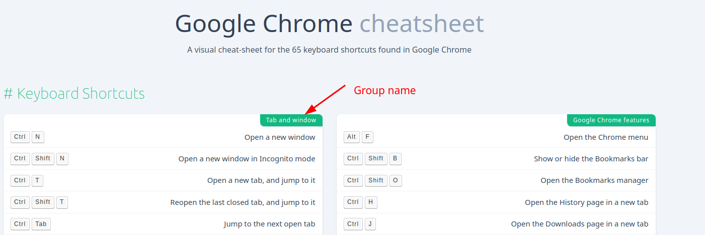

# Kebihelp - The Universal Linux Key Bindings Helper

Kebihelp is an universal key-bindings helper for Linux, written in Python and initially inspired by AwesomeWM and its "Mod4+s" feature.


Click on the picture to zoom.

In this demo:
- <Windows+s> displays the helper
- <TAB> key is used to cycle through the tabs.
- <ESC> is used to close it

## Features

- Facilities to import shortcuts from existing files or websites
- Organize shortcuts with Tabs and Groups
- Customizable design (colors, opacity, fonts, etc.)
- Window Rules supported, to show the shortcuts for the current focused app
- CLI commands to manage the shortcuts

## Usage

The code is a Python 3 script using PyQT5. You just need to clone this repository and run `pip3 install -r requirements.txt`.

Then you have to launch `kebihelp.py` with the relevant options. The tool has 5 main commands:

- `import` to import a file containing shortcuts
- `tabs` to show the available templates
- `manage` to show the available templates
- `keys` to show the keybindings configured
- `show` to show the helper in itself

For each command, you can type `kebihelp.py <command> -h` to get help.

The configuration file is stored in `~/.config/kebihelp.json`, which is a JSON file. You can add your shortcuts there.

When the helper is launched with the `./kebihelp.py show`, you can navigate through the tabs with the `<TAB>` key. The helper is closed with the `<ESC>` key.

### Importing keybindings

Instead of entering manually each keybinding, you can import them from existing files or websites.

To see the available importers, type `kebihelp.py import -l`

Currently the supported importers are as follows, but it's not difficult to add additional ones (contact me if needed).

| ID | Parser                            | Category            | Desktop | File                                      | Group support |
|----|-----------------------------------|---------------------|---------|-------------------------------------------|---------------|
| 1  | Kitty Default Shortcuts           | Terminal            | All     | https://sw.kovidgoyal.net/kitty/overview/ | True          |
| 2  | Brave Browser Default Shortcuts   | Browser             | All     | https://quickref.me/brave                 | True          |
| 3  | KDE Global Shortcuts              | Desktop environment | KDE     | ~/.config/kglobalshortcutsrc       | True          |
| 4  | Vivaldi Browser Default Shortcuts | Browser             | All     | https://quickref.me/vivaldi               | True          |
| 5  | Chrome Browser Default Shortcuts  | Browser             | All     | https://quickref.me/google-chrome         | True          |
| 6  | Gmail Default Shortcuts           | App                 | All     | https://quickref.me/gmail                 | True          |
| 7  | KDE Custom Shortcuts              | Desktop environment | KDE     | ~/.config/khotkeysrc               | False         |
| 8  | KDE Dolphin shortcut              | Desktop environment | KDE     |                                           | False         |
| 9  | Firefox Browser Default Shortcuts | Browser             | All     | https://quickref.me/firefox               | True          |

All the shortcuts available on [QuickRef](https://quickref.me) can be added very easily. More info in the "Developing new importers" section.

You can choose the importer with the `-i` option, which indicates the index of the importer as displayed by the `kebihelp.py import -l` command.

Some keybindings files (or websites) are organized by groups, but that's not the case for some others.
- If the keybinding file/website does not support group, you need to mention the group in which you want to import the keybindings, using the option `-g`
- If the keybinding file/website supports groups, you can also override the groups with the `-g` option if you want. If this is not the case, you will need to add a unique prefix with the `-p` option, so Kebihelp will not add your shortcuts to a potential existing group.

**Examples:**

Imports all shortcuts from `~/config/kglobalshortutsrc`. As the shortcuts of these files are organized in groups, you don't need to specify a group but only a prefix to name them uniquely.
```
./kebihelp.py import -i 3 -p KDE
```

For the Vivaldi or other browsers, the default keybindings are (for now) retrieved from QuickRef. As QuickRef shows keybindings organized by groups, you also need to enter the prefix. 
```
./kebihelp.py import -i 2 -p Vivaldi
```

For Dolphin (KDE file manager), you need first to export the shortcuts to a file using Dolphin itself. Then, as the file does not contain groups, you need to use the `-g` option, so Kebihelp will know in which group the imported keybindings will go.
```
./kebihelp.py import -i 4 -p Dolphin -g Dolphin -f ~/dolphin.shortcuts
```

For any import method supporting file import, you can override the file to be imported using the `-f` option.

All imported shortcuts are associated to one or more groups, and these groups are associated to the `Default` tab. The `Default` tab is the tab displayed when the helper is launched.
 
#### Filtering the shortcuts to be imported

You may want to filter the shortcuts to be imported. In this case, you can use one of the following option:

```
-fg <group name> will import only a particular group from the file/website
-fn <string> will import only shortcuts if the label/description contains <string>
-fv <string> will import only shortucts if the shortcut itself contains <string>
```

Let's say you only want to import the default Chrome shortcuts containing the "Ctrl" key. You will type:

```
./kebihelp.py import -i 5 -p Chrome -fv Ctrl
```

### Managing keybindings

The `manage` module allows you to do quick modifications in the config file without editing it:
- associate or dissociate a group of shortcuts to a tab
- hide/unhide a tab in the helper
- disable/enable a group of shortcuts so it will not be displayed anymore in the helper, without being removing from the config file

**Examples**

Import Dolphin shortcuts to the group Dolphin, associate the group to the Dolphin tab, and dissociate it from the Default group:
```
./kebihelp.py import -i 4 -p Dolphin -g Dolphin -f ~/dolphin.shortcuts
./kebihelp.py manage -a associate -g Dolphin -t Dolphin
./kebihelp.py manage -a dissociate -g Dolphin -t Default
```

Import KDE Global Shortcuts and disable the 'Wacom Tablet' group, so it is not showed anymore when you launch the helper:
```
./kebihelp.py import -i 3 -p KDE  // The KDE shortcuts will be in the 'Default' tab
./kebihelp.py manage -a disablegroup -g 'Wacom Tablet'
```

Hide the "Chrome" tab in the helper as you want to show it only if the helper is launched when the focus is on Chrome (more on this later):
```
./kebihelp.py manage -a hidetab -t Chrome
```

### Listing shortcuts and tabs (console mode)

You can display the tabs and the shortcuts with the following commands:
```
./kebihelp.py keys
./kebihelp.py tabs
```

The first command supports the following options:
```
-fg <group>  to only show shortcuts belonging to a particular group
-fs <source> to only show shortcuts imported from a particular source 
-fn <name> to only show shortcuts where <name> is in the description of the shortcut
-fk <key> to only show shortcuts where <key> is in the shortcut
-a to show all shortcuts, even the disabled ones
-t <tab name> to show all shortcuts displayed on a particular tab
```

### Launching the helper

To launch the helper, you just have to type the following command:
```
./kebihelp.py show
```

Of course, you will want to associate this command to a shortcut in your Desktop Environment. Personnally, I use the AwesomeWM mapping, so each time I type `<Windows>+s` the helper is displayed. 

The `show` command supports the `-t <tab>` option, to open the helper with the selected tab focused. 

```
// Open the helper and show the shortcuts associated to the Chrome tab
./kebihelp.py show -t Chrome
```

## Structure of the JSON configuration file

`kebihelp.json` has three main sections:

- `Parameters` to store the main configuration, especially UI customization
- `Tabs` to store the association between keybinding groups and tabs
- `Rules` to store the Rules (more on this later)
- `Shortcuts` to store the groups of keybindings

### Parameters

`cmd_focused_window` allows you to define the command used to get the name of the current focused window. This is useful when you define Rules to display the tab corresponding to the application you are working on.
`layout` enables you to customize the full design of the helper: number of columns, spacing, colors, opacity, font, etc. The various options should be self-explanatory.

### Tabs

The `Tabs` part contains, for each tab,the associated groups:

```
"Kitty": {
      "visible": true,
      "include": [
        "Kitty-Scrolling",
        "Kitty-Tabs",
        "Kitty-Windows",
        "Kitty-Other keyboard shortcuts"
      ]
    },
```

Here, the `Kitty` tab contains 4 groups of shortcuts. The `visible` option allows you to hide a Tab. If a Tab is hidden, it will not be shown in the helper except if there is a rule to show it.

### Rules

Rules allow you to show a particular tab in the helper when it is launched, depending of the currently focused Window.

```
"Rules": {
    "default": "Default",
    "Vivaldi": "Vivaldi"
  },
```

The `default` rule should always be here. In the example above, it says that when you launch the helper, the `Default` tab is shown and focused.
The second one says that if the current focused window contains the word "Vivaldi", then the tab named Vivaldi will be shown in the helper, showing all the Vivaldi shortcuts.

Let's say you need to show the Chrome shortcuts, but only when you are working on Chrome. You can:

1. First, import all Chrome Shortcuts
```
./kebihelp.py import -i 5 -p Chrome
```

2. Dissociate them from the `Default` tab and associate them to the `Chrome` tab:
```
./kebihelp.py manage -a associate -g Chrome -t Chrome 
./kebihelp.py manage -a dissociate -g Chrome -t Default
```

3. Hide the `Chrome` tab globally in the helper
```
./kebihelp.py manage -a hidetab -t Chrome
```

4. Adding manually a rule in the `Rules` section, so the `Chrome` tab will be shown when you are working on Chrome.
```
"Rules": {
    "default": "Default",
    "Chrome": "Chrome"
  },
```

Then, when you open the helper, the command specified by the `cmd_focused_window` will be launched. The name of the current focused window will be retrieved by this command.
If it matches a rule, then the Chrome tab will be displayed.

### Shortcuts

The `Shortcuts` section enables to define the groups of shortcuts. 

```
"KDE-KWin": {
  "_enabled": true,
  "Activate Window Demanding Attention": [
    "Meta+Ctrl+A",
    true,
    "KDE Global Shortcuts"
  ],
  ...
}
```

`KDE-KWin` is the group name, `KDE` being the prefix that uniquely defines the group name. When you launch the helper, only `KWin` will be shown as the label of the group.
The prefix is important as many groups of shortcuts may have the same name. For instance, it is unusual that in shortcuts files and websites, there is a group called "Window" to define the keybindings for Windows. Setting up a prefix is the only way to dissociate these groups.

The `_enabled` parameter allows you to disable a group. A disabled group is no more displayed in the helper. 
You can disable a group by editing the config file, or by using the command `kebihelp.py -a manage disablegroup -g <group name>`

Then, you have all shortcuts associated to this group:
- The key is the label of the shortcut that will be displayed when you launch the helper
- The first parameter is the keybinding in itself
- The second parameter is the enabled/disabled value for the shortcut, so you can remove a shortcut individually without removing it from the config file
- The third paramter is the "source" of the shortcut. Here, it has been imported from the "KDE Global Shortcuts" importer. 

## Developing new importers

Keybindings are complicated: there are absolutely no common standard to define them. Each system and application has its own format. There are various ways to import them:
- By locating the file where there are stored,
- By exporting them from the targeted application in itself,
- By getting a website or file that shows the "default" keybindings. 

The last option is the worst one because you will not have your customized shortcuts. However, it can be used as a good start if the number of customized bindings is limited.

In Kebihelp, we defined some importers. Most of them support "groups", meaning that the file or URL containing the keybindings are organized by groups. If we take the default keybindings from [QuickRef](https://quickref.me) for instance, it is displayed like that:



Most of keybinding files support groups, but it's not always the case.

### Parsers classes

To add a new parser, you just need to add a file in the `parsers` directory, containing the class with the relevant properties and methods. It will be automatically detected.

- Usual parsers classes are child of the `libs.Parser` class.
- Quickref parsers are child of the `libs.QuickRefParser` class

Sometimes, you need to do everything by hand, therefore there is no inheritance. This is  the case for the `Kitty_Default` parser, which scrapes the default shortcuts of the Kitty terminal directly on the Kitty website.


### Adding support of a QuickRef cheatsheet

This is the simplest option. You just need to copy one of the existing QuickRef parsers to a new file, modify the names and description, and you are done. 

```
import libs.QuickRefParser as Parser

class Firefox_Default(Parser.Parser):
    def __init__(self):
        description = {
            "name" : "Firefox Browser Default Shortcuts",
            "category": "Browser",
            "desktop": "All",
            "url": 'https://quickref.me/firefox',
        }
        super(Firefox_Default, self).__init__(description)

    def parse(self, default_group = None, overriden_file=None):
        super().parse(default_group)
```

### Adding other parsers

For other parsers, you need to take example on the existing ones.
- `Kde_Global_Shortcuts.py` for a standard parser loaded from a file
- `Kitty_Default` for a standard parser scraped from an URL

### I can help

If you want to make an importer for a widely-used system, please post an issue with the format of the file or the URL, I should be able to do it quickly.

## Feedbacks

This tool is not perfect, but it may be useful to build your own "keybinding helper" if your Desktop Environment does not support this feature.
Your contributions are welcomed!

[](https://www.buymeacoffee.com/juienpro)
